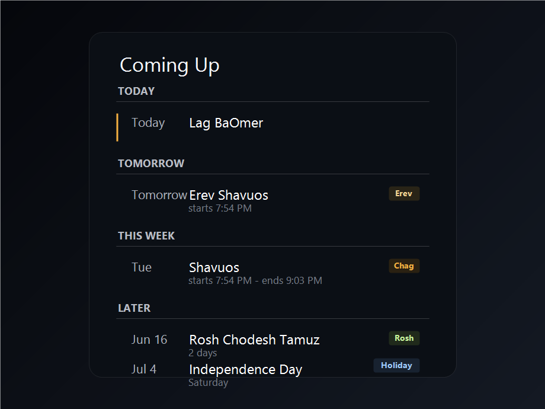

# MMM-Moed

MMM-Moed is a compact MagicMirror agenda module for Jewish holidays, US holidays, and other iCal feeds. It turns raw calendar data into a small "Today & Soon" view with useful timing, semantic badges, collapsed multi-day observances, and no noisy date/source subtitles.



## Highlights

- Groups upcoming events into `Today`, `Tomorrow`, `This week`, and `Later`.
- Shows exactly the first `maximumEntries` agenda rows after filtering and collapsing. There is no `+N more` footer.
- Infers compact badges from event names: `Chag`, `Rosh`, `Erev`, `Fast`, `Israeli`, and `Holiday`.
- Leaves minor Jewish holidays such as Purim, Lag BaOmer, and Tu B'Av unbadged so the display stays calm.
- Collapses consecutive full-day rows for the same observance, for example `Shavuos I` plus `Shavuos II` becomes one `Shavuos` range.
- Uses Hebcal timing rows (`Candle lighting`, `Havdalah`, `Fast begins`, `Fast ends`) as metadata instead of rendering them as separate agenda rows.
- Keeps row spacing stable: if there is no useful subtitle, the subtitle line is blank. In the `Later` section, that otherwise-empty subtitle shows the weekday.
- Separates feed refresh from render refresh so labels like `Today` and `Tomorrow` stay current without refetching calendar data.

## Installation

Clone this module into the MagicMirror `modules` directory:

```sh
cd ~/MagicMirror/modules
git clone https://github.com/supermem613/MMM-Moed.git
```

Then add it to `config/config.js`.

## Configuration

```js
{
    module: "MMM-Moed",
    header: "Coming Up",
    position: "top_left",
    config: {
        fetchInterval: 4 * 60 * 60 * 1000,
        renderRefreshInterval: 5 * 60 * 1000,
        maximumEntries: 8,
        maximumNumberOfDays: 45,
        calendars: [
            {
                label: "US",
                type: "holiday",
                url: "webcal://www.calendarlabs.com/ical-calendar/ics/76/US_Holidays.ics"
            },
            {
                label: "Hebcal",
                type: "jewish",
                url: "webcal://download.hebcal.com/v2/h/..."
            }
        ]
    }
}
```

## Options

| Option | Default | Description |
| --- | --- | --- |
| `calendars` | `[]` | iCal feeds to render. Each feed can include `label`, `type`, `url`, and optional fetch options supported by MagicMirror's default calendar fetcher. |
| `excludedEvents` | `[]` | Case-insensitive title substrings to hide before grouping and collapsing. |
| `fetchInterval` | `14400000` | How often to refresh calendar feed data. Defaults to 4 hours. |
| `maximumEntries` | `8` | Maximum number of agenda rows to render across all sections after filtering and collapsing. |
| `maximumNumberOfDays` | `45` | How far ahead to fetch and consider events. |
| `renderRefreshInterval` | `300000` | How often to re-render without fetching data, keeping relative labels fresh. Set to `0` to disable. |

## Calendar feeds

MMM-Moed accepts the same iCal-style feed URLs used by MagicMirror's default `calendar` module. Feed objects should include:

| Field | Description |
| --- | --- |
| `url` | Required iCal URL. `webcal://` URLs are accepted. |
| `label` | Human-readable source label used internally for classification. |
| `type` | Optional classification hint. Use `jewish` for Hebcal/Jewish feeds and `holiday` for civil holiday feeds. |

For Hebcal, use a timing-enabled feed if you want start/end subtitles. The useful pieces are:

- `c=on` to include candle-lighting and havdalah events.
- A real location (`geo=pos`, latitude, longitude, and `tzid`) so times are local.
- `i=off` for diaspora observance, or `i=on` for Israel observance.
- `M=on`, `b=18`, and `m=50` if you want commonly used havdalah/candle timing settings.

Timing rows are consumed as metadata. They are not shown as standalone agenda items.

## Display behavior

### Sections

Events are sorted by start date and grouped into:

| Section | Meaning |
| --- | --- |
| `Today` | Events starting today. |
| `Tomorrow` | Events starting tomorrow. |
| `This week` | Events within the next 7 days. |
| `Later` | Events beyond the next 7 days, up to `maximumNumberOfDays`. |

### Badges

Badges are inferred from event titles:

| Badge | Examples |
| --- | --- |
| `Chag` | Pesach, Shavuos, Sukkos, Rosh Hashana, Yom Kippur, Shmini Atzeres, Simchas Torah. |
| `Rosh` | Rosh Chodesh rows. |
| `Erev` | Erev chag rows. |
| `Fast` | Tisha B'Av, Tzom Gedaliah, Asara B'Tevet, Ta'anit Esther, Shiva Asar B'Tammuz, fast timing rows. |
| `Israeli` | Yom HaAtzma'ut, Yom HaShoah, Yom HaZikaron, Yom Yerushalayim. |
| `Holiday` | US civil holidays from feeds marked as `holiday`. |

Minor Jewish holidays can render without a badge by design.

### Collapsed ranges

Consecutive full-day rows for the same observance collapse into one row. This keeps multi-day holidays readable:

| Feed rows | Display |
| --- | --- |
| `Shavuos I`, `Shavuos II` | `Shavuos` with a two-day date range. |
| `Rosh Chodesh Tamuz`, `Rosh Chodesh Tamuz` | One `Rosh Chodesh Tamuz` row with `2 days`. |
| `Pesach I` through `Pesach VIII` | One `Pesach` range when the days are consecutive in the feed. |

Erev rows stay separate from the main observance.

### Subtitles

Subtitles only show useful context:

| Row type | Subtitle behavior |
| --- | --- |
| Erev/chag rows with timing | `starts 7:54 PM`, `ends 9:03 PM`, or `starts 7:54 PM - ends 9:03 PM`. |
| Fast rows with timing | `fast 5:12 AM-8:44 PM`, or a begin/end-only variant if only one timing exists. |
| Collapsed ranges without timing | `2 days`, `3 days`, etc. |
| Rows without timing/range details in `Today`, `Tomorrow`, or `This week` | Blank subtitle line, preserving spacing. |
| Rows without timing/range details in `Later` | Weekday, such as `Saturday`. |

Date/source provenance such as `May 5 - Hebcal` is intentionally not shown.

## Development

Run the existing project checks from the MagicMirror repo root:

```sh
node --check modules/MMM-Moed/MMM-Moed.js
node --check modules/MMM-Moed/node_helper.js
node js/check_config.js
git diff --check -- modules/MMM-Moed
```

## License

MIT
